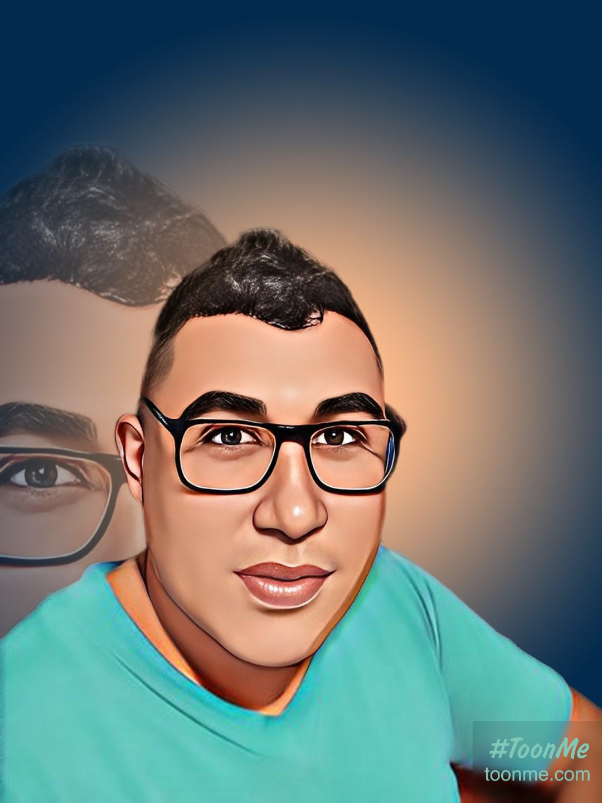

<!-- Fondo con líneas verdes y foto circular -->

  <!-- Foto redonda -->
  

  <!-- Texto saludo -->
  <h1 style="color: white; font-size: 2.5rem; margin: 10px 0;">👋🏿 ¡Hola! Soy Pablo Carabajal</h1>
  

    Fullstack Developer enfocado en el Backend 💻 
    ¡Apasionado por Java, Spring, MySQL y Angular! 🚀
  

<!-- Tecnologías Backend -->
<h2 align="center">🚀 Tecnologías Backend</h2>

  
  

<!-- Tecnologías Frontend -->
<h2 align="center">🎨 Tecnologías Frontend</h2>

  

<!-- IDEs -->
<h2 align="center">🛠️ Herramientas de Desarrollo (IDEs)</h2>

  
  
  

